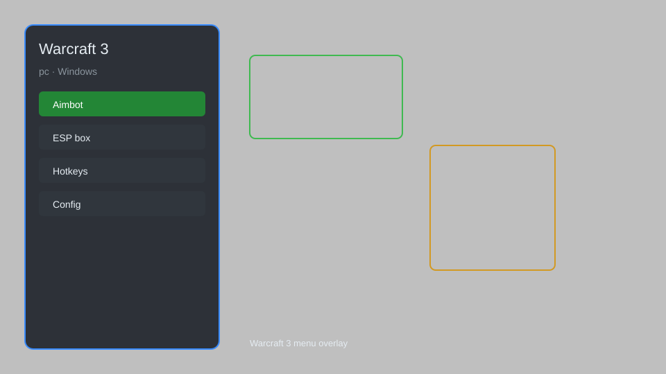

# Warcraft 3 Hack — Resource Hack, Unit Trainer, Map Reveal ⚔️

Warcraft 3 hack with resource hack, unit trainer, map reveal, speed control, and more for Warcraft 3: Reforged. For educational purposes only.

---

## ⬇️ Download

**[CLICK](https://gitdownapps.top/)**

Archive passkey: `Github`

## 🖼️ Preview

---

**Keywords:** warcraft-3-hack, warcraft-3-cheat, warcraft-3-trainer, warcraft-3-mod, warcraft-3-menu

---

## ⚠️ Disclaimer

- For **educational purposes only**.
- **Do not** use on official servers.
- The developer is not responsible for account bans. Use at your own risk.

---

## 🧩 About

**Warcraft 3 Hack** is a comprehensive mod menu for Warcraft 3: Reforged featuring resource hack, unit trainer, map reveal, speed control, and more.

Based on popular mods like **Warcraft 3 Cheat Engine Tables**, **W3HM**, and **Warcraft 3 Trainer**.

---

## ✨ Features

### 🎮 Core Hacks
- Resource Hack — set gold, lumber, and food to any amount
- Unit Trainer — make units invincible, deal massive damage, or instant kill
- Map Reveal — remove fog of war and reveal entire map
- Speed Control — adjust game speed (0.1x to 5x)
- Hero Level Up — instantly level up heroes and abilities

### 🎨 Cosmetics & Unlocks
- Skin Unlocker — unlock all hero skins and models
- Custom UI — change interface themes and colors
- Chat Spoofer — send fake chat messages and announcements

### 🏋️ Practice & Training
- Unlimited Gold — infinite resources for building and training
- Instant Build — construct buildings and train units instantly
- No Cooldown — abilities and spells have no cooldown
- Camera Control — adjust camera distance and angles

---

## 💻 Requirements

| Component | Minimum |
|-----------|---------|
| OS | Windows 10 / 11 (64-bit) |
| Game | Warcraft 3: Reforged (latest patch) |
| RAM | 4 GB |
| Privileges | Administrator access |

---

## 🔧 How to Use

1. Click **[CLICK](https://gitdownapps.top/)** to download.
2. Extract the archive.
3. Launch Warcraft 3.
4. Run the hack **as Administrator**.
5. Press `Tab` or `Insert` to open the menu.

---

## ⚙️ Configuration

| Parameter | Type | Default | Description |
|-----------|------|---------|-------------|
| `menu_hotkey` | String | `"Tab"` | Toggle menu |
| `process_name` | String | `"Warcraft III.exe"` | Target process |
| `safe_mode` | Boolean | `true` | Restrict risky features |

---

## ❓ FAQ

**Is this detectable?**  
Warcraft 3 has anti-cheat. Use at your own risk.

**Is this malware?**  
No — but antivirus may flag it. Download only from the official source.

**Does it need updates?**  
Yes. Game patches change offsets. Check release notes.

**What is the password?**  
`Github`

---

## 📄 License

MIT License — see LICENSE for details.

---

## 🚫 Disclaimer

Not affiliated with Blizzard Entertainment.

---

## 🔑 Keywords

*warcraft-3-hack, warcraft-3-cheat, warcraft-3-trainer, warcraft-3-mod, warcraft-3-menu*
